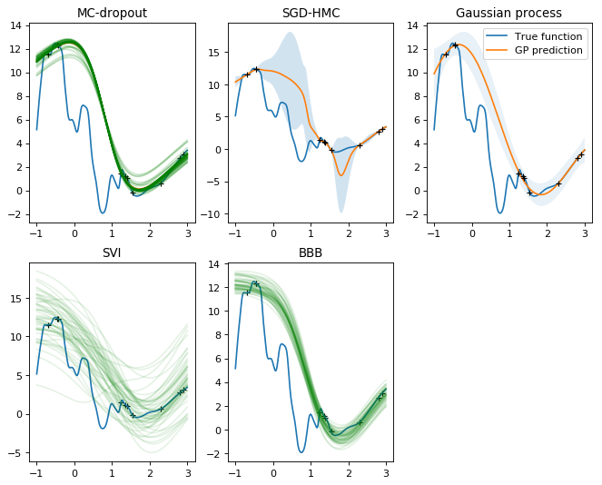

# README

Implementation of several Bayeisan neural networks 

Implemented:

- MC dropout
- SGD-HMC
- SVI 
- BBB




## MC-dropout on concreate dataset

- Three hidden layers, with tanh activation function
- Dropout rate, learning rate, precision and length scale are obtained by running Bayesian optimization using the training data of the #19 split

```
conf['dropout_rate'] = 0.01
conf['lr']           = 0.1
conf['tau']          = 0.15
conf['lscale']       = 0.25
conf['batch_size']   = 128
conf['num_epochs']   = 1600
conf['num_layers']   = 3
conf['num_hidden']   = 50
```

`RMSE(reported)` and `NLL(reported)` can be seen in `UCI_Datasets/concrete/results`

Train_Test Split ID | RMSE     | NLL      | RMSE(reported)       | NLL(reported)
--------------------|----------|----------|----------------------|----------------------
0                   | 4.57     | 3.02     | 5.438703427547408    | 3.0498930186595428
1                   | 3.68     | 2.69     | 4.673398821075422    | 2.930489207038067
2                   | 3.30     | 2.60     | 3.7604257762839493   | 2.7917025469190224
3                   | 4.60     | 2.94     | 4.535900597832999    | 2.9249630654602736
4                   | 5.23     | 3.07     | 5.56192235179972     | 3.0924028369497027
5                   | 3.92     | 2.71     | 3.9881517544487157   | 2.830087106592978
6                   | 4.51     | 2.92     | 5.878222785137136    | 3.028777661296283
7                   | 4.83     | 2.90     | 5.170036313029098    | 2.9874813175062247
8                   | 3.72     | 2.74     | 4.552494476421576    | 2.8692172804169984
9                   | 4.30     | 2.84     | 4.880133112990969    | 2.9762331118227525
10                  | 3.52     | 2.55     | 3.768809222617631    | 2.710934497558663
11                  | 4.10     | 2.73     | 4.458397179309968    | 2.8171335896701164
12                  | 4.72     | 3.06     | 4.447321253800009    | 2.882523035425393
13                  | 3.42     | 2.60     | 3.8189718495980203   | 2.7977036086593725
14                  | 4.98     | 3.03     | 5.814561623889275    | 3.0500209788479316
15                  | 4.67     | 2.84     | 4.887840398517562    | 2.9324900927453728
16                  | 3.17     | 2.70     | 4.543333343672162    | 2.9564102950535593
17                  | 4.42     | 2.92     | 4.44982560369068     | 2.8958148206484453
18                  | 4.85     | 2.93     | 5.917640186601453    | 3.127511896792499
19                  | 4.90     | 2.84     | 5.983116474630151    | 3.0813276071444693
Summary             | 4.27±0.61| 2.83±0.16| 4.82±0.72            | 2.93±0.11


## MC-dropout on bostonHousing dataset

- Three hidden layers, with tanh activation function
- Dropout rate, learning rate, precision and length scale are obtained by running Bayesian optimization using the training data of the #9 split

```
conf['dropout_rate'] = 0.01
conf['lr']           = 0.007
conf['tau']          = 0.11
conf['lscale']       = 0.05
conf['batch_size']   = 128
conf['num_epochs']   = 1600
conf['num_layers']   = 3
conf['num_hidden']   = 50
```

Train_Test Split ID | RMSE     | NLL      | RMSE(reported)       | NLL(reported)
--------------------|----------|----------|----------------------|----------------------
0                   | 2.19     | 2.30     | 2.7456764186182667   | 2.443888536053014
1                   | 2.77     | 2.45     | 2.6407723006975306   | 2.4483468750030273
2                   | 2.27     | 2.33     | 2.34984308942956     | 2.2449695537209813
3                   | 2.60     | 2.40     | 2.6616566967002213   | 2.346866850464276
4                   | 3.63     | 2.70     | 3.8541530268046373   | 2.7346083521004574
5                   | 2.08     | 2.29     | 1.9960197076622652   | 2.1788291741009265
6                   | 2.36756  | 2.35167  | 1.859032134705851    | 2.1446279770561327
7                   | 2.66355  | 2.38853  | 3.595564842208209    | 2.4841174240149497
8                   | 3.17654  | 2.56661  | 3.7396959501442506   | 2.634877140654101
9                   | 4.0484   | 2.80208  | 4.973758481199966    | 2.850389294755875
10                  | 3.25214  | 2.59544  | 3.7574957466443437   | 2.6083354898012274
11                  | 2.95983  | 2.29914  | 2.2472323265570355   | 2.1627209577135114
12                  | 2.69137  | 2.41908  | 2.2934673512640074   | 2.2995008226440277
13                  | 2.88778  | 2.46551  | 2.983380964211       | 2.3855348721884617
14                  | 2.01871  | 2.26913  | 2.1599913796488086   | 2.239866388395959
15                  | 2.00805  | 2.27473  | 2.0506266556970996   | 2.2248633555088224
16                  | 3.06527  | 2.52872  | 2.8071661038842346   | 2.3823056896606287
17                  | 2.57849  | 2.39199  | 2.8964619205003292   | 2.375882311866735
18                  | 2.90164  | 2.4869   | 2.627675944969965    | 2.3740385828094412
19                  | 3.81544  | 2.56498  | 3.832783478660309    | 2.474141878780316
summary             | 2.80±0.57| 2.44±0.14| 2.90±0.79            | 2.40±0.19
