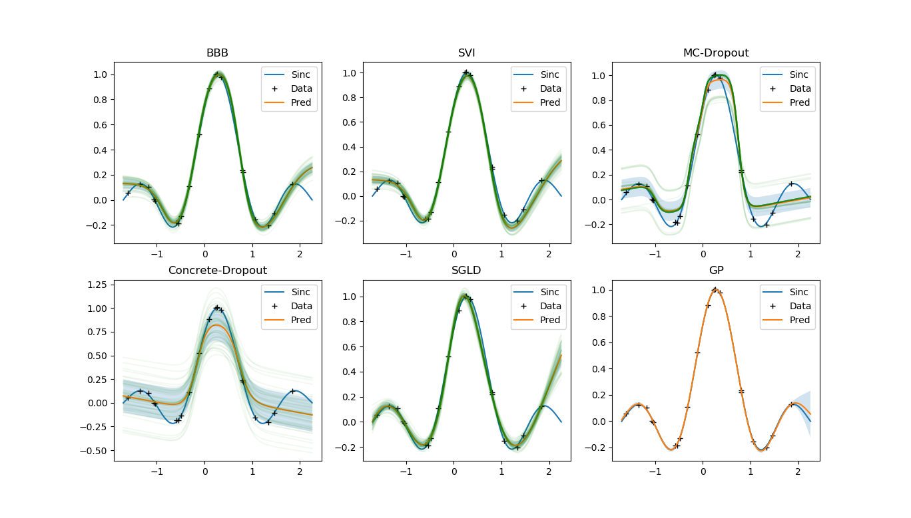

# README

Implementation of several Bayeisan neural networks 

Implemented:

- MC dropout
- SGLD
- SVI (from pyro) 
- BBB

## TODO

- Variational continual learning (for online learning)
- Neural process
- Stein Variational Gradient Descent
- Particle mirror descent
